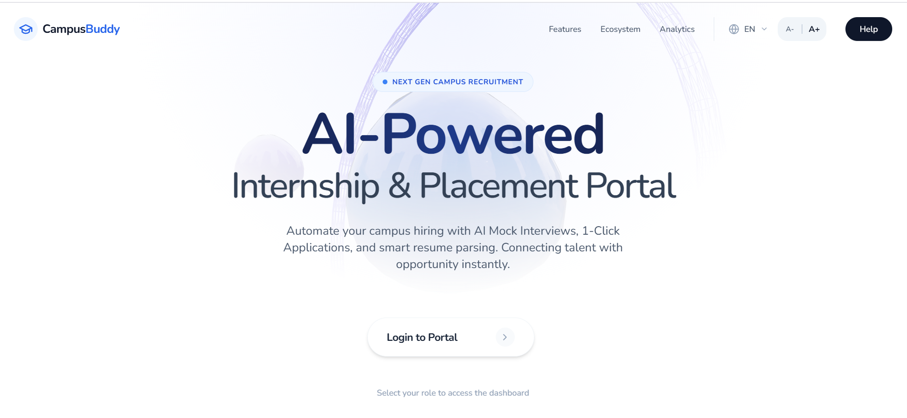
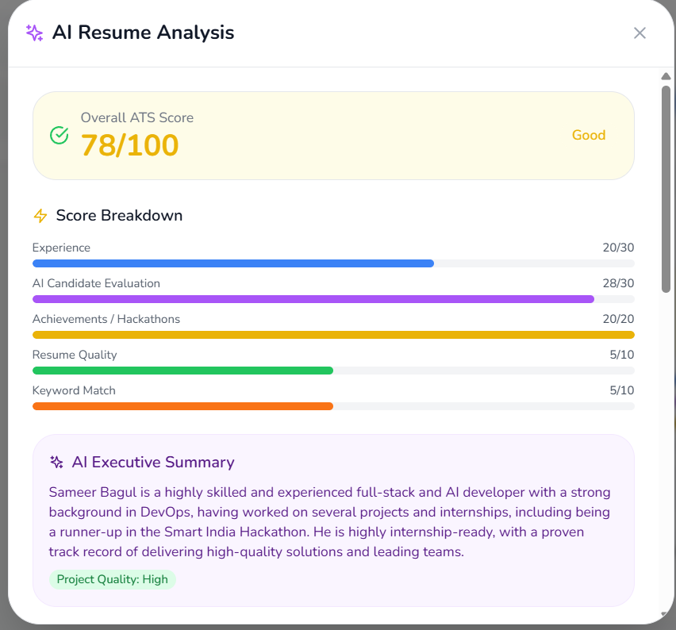
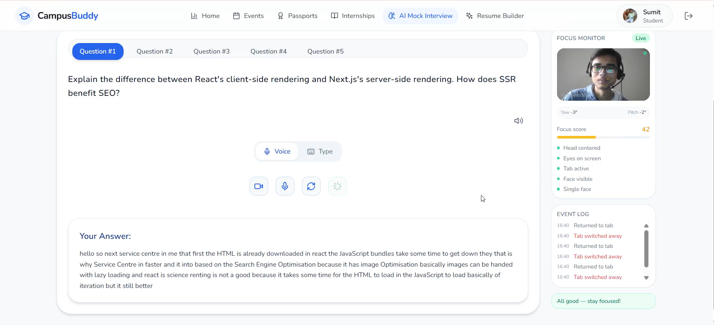

<div align="center">

# CampusBuddy — AI-Powered Campus Placement and Internship Platform

### One Unified System for Resume Intelligence, Interview Readiness, and Placement Automation

[](https://react.dev/)
[](https://nodejs.org/)
[](https://developer.mozilla.org/en-US/docs/Web/JavaScript)
[](https://www.mongodb.com/)
[](https://render.com/)
[](https://cloudinary.com/)
[](https://n8n.io/)
[](https://www.framer.com/motion/)
[](https://openrouter.ai/)
[](LICENSE)

> "From placement chaos to verified, AI-assisted execution."

🎬 **[Watch Demo Video](https://www.youtube.com/watch?v=A15PEUzelfs)**  
🌐 **[Live Demo](https://strotas-frontend.onrender.com/)**

</div>

---

## Problem Statement

Campus internship and placement workflows are fragmented across WhatsApp groups, emails, and spreadsheets. This causes missed deadlines, delayed approvals, low transparency, and heavy manual coordination for placement cells.

CampusBuddy solves this through a role-based, AI-enabled, automation-first platform.

---

## Screenshots

### Platform Overview (Student Experience)

Unified student experience across internships, profile, resume, and interview workflows.



### AI Mock Interview (Tab Switch + Multiple Face Logs)

Interview integrity signals are tracked in real time through event logs and focus monitoring.



### AI Resume Analysis (ATS Score + Executive Summary)

ATS insights include score components, quality diagnostics, and AI-generated profile summary.



## Challenge vs Solution

| Challenge                  | Traditional Workflow     | CampusBuddy                                 |
| -------------------------- | ------------------------ | ------------------------------------------- |
| Notices scattered          | WhatsApp + email chaos   | Unified platform dashboard                  |
| Resume quality unclear     | Manual subjective review | ATS score + AI summary + score breakdown    |
| Interview integrity issues | No monitoring            | CV-based focus monitor + event logs         |
| Slow approvals             | Follow-ups across people | n8n-driven automated workflow actions       |
| Weak visibility            | No shared status view    | Role-scoped dashboards for all stakeholders |

---

## Core Modules

### 1) AI Resume Checker (ATS)

- ATS score out of 100 with transparent breakdown:
- Experience (0-30)
- AI Candidate Evaluation (0-30)
- Achievements/Hackathons (0-20)
- Resume Quality (0-10)
- Keyword Match (0-10)
- AI Executive Summary and rewritten bullet suggestions
- Actionable quality checks (sections, contact, content, formatting)

### 2) AI Mock Interview

- Live interview interface with voice/text answer support
- Focus Monitor powered by computer vision signals
- Tab-switch event logging
- Multiple-face detection logging
- Suspicion/focus scoring and session event timeline

### 3) Resume Builder and Student Profile

- Multi-section resume builder with templates
- Public/private visibility controls and PDF export
- Profile-integrated resume generation workflow

### 4) Skill Gap AI

- Skill-gap analysis and targeted recommendations
- Learning-focused guidance for interview and role readiness

### 5) Automation Layer (n8n)

- Event-driven alerts, reminders, and status updates
- Mentor/recruiter workflow automation and integrations

---

---

## Architecture Overview

```text
Frontend (React + Tailwind)
    -> Role-based UI (Student / Mentor / Recruiter / Admin)
    -> Resume Builder, ATS, AI Interview, Dashboards

Backend (Node.js + Express)
    -> Auth + APIs + business workflows
    -> Internship, profile, resume, ATS, analytics modules

Data and Services
    -> MongoDB (core application data)
    -> Firebase (AI interview/session modules)
    -> Cloudinary (files/media)
    -> Google Gemini via OpenRouter (AI resume/skill insights)
    -> MediaPipe FaceMesh (interview monitoring)
    -> n8n (automation + external notifications)
```

---

## Technology Stack

| Layer            | Technology                                     | Purpose                                                   |
| ---------------- | ---------------------------------------------- | --------------------------------------------------------- |
| Frontend         | React 18, Tailwind CSS, Framer Motion          | UI, responsive screens, interaction                       |
| Backend          | Node.js, Express.js                            | APIs and workflow logic                                   |
| Database         | MongoDB                                        | Users, profiles, internships, applications, resume data   |
| Interview Module | Firebase                                       | Session/real-time interview data components               |
| Auth             | Clerk                                          | Secure role-based access                                  |
| Storage          | Cloudinary                                     | Resume/file handling and delivery                         |
| AI               | Google Gemini (via OpenRouter) + CV (FaceMesh) | Resume intelligence, skill guidance, interview monitoring |
| Automation       | n8n                                            | Event-driven notifications and operations                 |

---

---

## Viability and Scalability

- Open-source-first architecture with low licensing overhead
- Single deployment supports 4 stakeholder roles
- Modular AI layer (provider/model can be swapped)
- Automation scales operations without equivalent headcount increase
- Integration-ready APIs for institutional systems

---

## Local Setup

```bash
git clone https://github.com/AmateurMind/STROTAS.git
cd STROTAS
npm run install:all
npm run dev
```

---

## Team

Team Vamos
